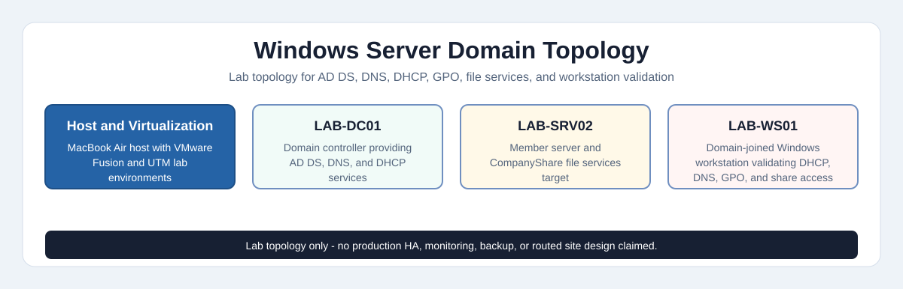

# Enterprise Windows Administration

### Windows Server 2022 · Active Directory · DHCP · DNS · Group Policy · File Services · Windows 11

**Md Rahat Islam Anik · Cloud Computing & Network Administration · Toronto, Canada**

[](https://rahatislamanik-spec.github.io/Windows-Server-2022-Enterprise-Domain/)
[](https://linkedin.com/in/rahatislamanik)
[](https://github.com/rahatislamanik-spec)

---

| 2 Environments Built | 158 Screenshots | 19 Tasks & Phases | 2 Servers + 1 Workstation |
|:---:|:---:|:---:|:---:|

---

## Overview

This project documents a lab-built enterprise Windows environment — covering both endpoint administration and a full Active Directory domain, built from scratch on a MacBook Air with no physical server hardware.

The two parts reflect the kind of work that shows up in junior sysadmin and IT administrator roles: provisioning and hardening a Windows 11 workstation, then deploying the server infrastructure it connects to — AD DS, DNS, DHCP, Group Policy, file services, and domain authentication.

Everything is screenshot-evidenced. The [live case study](https://rahatislamanik-spec.github.io/Windows-Server-2022-Enterprise-Domain/) walks through all 158 screenshots task by task.

If you want to see the DC promotion process in detail — the full configuration wizard step by step — that's documented separately in the companion repo:

> **Related project: [Windows-Server-Infrastructure-Active-Directory](https://github.com/rahatislamanik-spec/Windows-Server-Infrastructure-Active-Directory)** — focused deployment documentation covering the full AD DS installation and domain controller promotion workflow with 19 sequential screenshots.

---

## What This Demonstrates

| Skill Area | Evidence |
|---|---|
| Windows endpoint administration | Windows 11 provisioning, local security policy, PowerShell network config, Storage Spaces, file sharing |
| Windows Server administration | Server role installation, AD DS promotion, DHCP, DNS, file services, domain-joined workstation validation |
| Identity and access operations | OU design, domain users, security groups, share and NTFS permissions, domain authentication |
| Group Policy | GPO creation, domain and OU linking, enforcement verified via `gpupdate /force` and `gpresult /r` |
| Troubleshooting approach | NAT-only virtualization constraints documented, DNS forwarder limitations noted, workarounds explained |
| Documentation discipline | 158 screenshots, task-by-task evidence map, recruiter-readable case study page |

---

## Lab Scope

| Area | Status | Notes |
|---|---|---|
| Windows 11 endpoint build | Implemented and screenshot-verified | VMware Fusion on macOS |
| Windows Server AD DS forest | Implemented and screenshot-verified | Single-domain lab forest, one DC |
| DHCP / DNS / GPO / file sharing | Configured and validated | Internal lab — not a production network |
| Multi-site DHCP design | Simulated | Multiple scopes model site segmentation; no physical routers deployed |
| External DNS forwarding | Configured, partially constrained | UTM NAT behavior limited external lookup validation from the server |
| Production readiness | Not claimed | No HA DC pair, no backup plan, no monitoring or patch baseline |

---

## The Setup

No rack. No lab. No x86 hardware.

This was built entirely on a **MacBook Air (Apple Silicon)** — which ruled out PXE booting, bridged network adapters, and Hyper-V. Two virtualization platforms handled different parts: **VMware Fusion** for the Windows 11 client environment, and **UTM** for the Windows Server 2022 domain.

Working within those constraints was part of the exercise. Most of the decisions that had to be made — NAT-only networking, DNS forwarder configuration, scope design without a physical router — are decisions that come up in real environments too, just with different constraints.

> This was a simulated lab environment, not a production network. Screenshots have been reviewed and redacted where identifiers were visible.

---

## Part 1 — Windows 11 Enterprise Workstation Administration

> **Platform:** VMware Fusion · **OS:** Windows 11 Enterprise

### What Was Built

**Task 01 — Provisioning & Naming**
Deployed a fresh Windows 11 VM in VMware Fusion. Named to a consistent lab convention so configuration and evidence could be tracked cleanly across tasks.

**Task 02 — Local Security Policy**
Configured local Group Policy settings through `secpol.msc`: account lockout thresholds, password requirements, and audit policies. Verified enforcement through event log review.

**Task 03 — PowerShell Network Management**
Used PowerShell to configure network adapter settings, test connectivity, and manage IP configuration without touching the GUI — cleaner and scriptable.

**Task 04 — Storage Spaces**
Created a Storage Space pool using multiple virtual disks, configured a simple volume, and verified resilience settings — simulating enterprise storage consolidation on a workstation.

**Task 05 — File Sharing & NTFS Permissions**
Configured shared folders with explicit share permissions and layered NTFS permissions. Tested access under different user contexts to confirm restrictions were enforced correctly, not just set.

### Environment

| Component | Detail |
|---|---|
| Virtualization | VMware Fusion (macOS host) |
| OS | Windows 11 Enterprise |
| Host | MacBook Air (Apple Silicon) |
| Network | NAT (Fusion-managed) |

---

## Part 2 — Windows Server 2022 Enterprise Domain

> **Platform:** UTM (Apple Silicon) · **Domain:** lab.local · **Environment:** DC + Member Server + Workstation

### What Was Built

**Active Directory Domain Services**
Deployed a new forest and promoted the primary server to Domain Controller. DNS was integrated at promotion. The DC was validated post-promotion before adding any member servers or workstations.

**DHCP — Multi-Site Scopes**
Configured five DHCP scopes modeling a two-site organization:

- `Toronto Office` — primary user subnet
- `Toronto Lab` — isolated lab segment
- `Montreal Office` — remote site simulation
- `Montreal Lab` — remote lab segment

Address reservations created, lease assignment verified per scope, and DHCP lease confirmed visible from the workstation.

**Organizational Unit Structure**
Built a logical OU hierarchy reflecting a real two-site organization — designed so Group Policy can be targeted at the right level without bleed between sites or user types.

```
lab.local
├── Toronto
├── Montreal
├── Servers
├── Workstations
├── Groups
└── Users
```

**Users & Security Groups**
Created domain users and location-based security groups. Users assigned to appropriate groups and membership verified — not just created and left unchecked.

**Group Policy**
Created and linked GPOs at domain and OU level:

- Domain-wide password policy: complexity, length, expiry
- Account lockout policy: threshold, observation window, lockout duration

Verified with `gpupdate /force` and `gpresult /r` on the workstation. Policy application confirmed active, not just configured.

**File Services — CompanyShare**
Deployed a shared folder (`CompanyShare`) with layered permissions:

- Share-level: security group access
- NTFS-level: granular per-group permissions

Drive Z mapped from the workstation. Access restriction enforcement tested across different user accounts to confirm the permission model held.

**DNS**
Configured DNS forwarders for external resolution. Internal name resolution verified via DNS Manager and `nslookup`. Workstation DNS registration confirmed.

**Workstation Integration — End-to-End**
Joined a Windows 11 workstation to the domain and verified the full stack:

- DHCP lease assigned from the correct scope
- GPO applied and active on the workstation
- Drive Z mapped and share accessible under domain credentials
- Domain user logon functioning correctly

### Environment

| Component | Detail |
|---|---|
| Virtualization | UTM on Apple Silicon |
| Primary Server | LAB-DC01 — Domain Controller, DNS, DHCP |
| Member Server | LAB-SRV02 — domain member server |
| Workstation | LAB-WS01 — Windows 11, domain-joined |
| Domain | lab.local |
| Network | NAT-only (UTM limitation on Apple Silicon) |
| Host | MacBook Air (Apple Silicon) |

---

## Skills Demonstrated

`Active Directory Domain Services` · `Domain Controller Promotion` · `DHCP` · `DNS` · `Group Policy` · `NTFS Permissions` · `Share Permissions` · `Organizational Units` · `Security Groups` · `PowerShell` · `Storage Spaces` · `File Services` · `Windows Server 2022` · `Windows 11 Enterprise` · `VMware Fusion` · `UTM` · `Apple Silicon Virtualization`

---

## Repository Structure

| Path | Purpose |
|---|---|
| `README.md` | Project overview and evidence summary |
| `index.html` | GitHub Pages live case study |
| `assets/diagrams/` | Lab topology diagram (SVG + interactive HTML) |
| `assets/screenshots/` | Screenshot evidence used by the case study |
| `docs/evidence-map.md` | Task-by-task evidence and skills map |

For a quick review of what's covered, start with [`docs/evidence-map.md`](docs/evidence-map.md).

---

## Domain Topology



[View interactive HTML version](https://rahatislamanik-spec.github.io/Windows-Server-2022-Enterprise-Domain/assets/diagrams/domain-network-topology.html)

---

## Live Case Study

The full case study with 158 screenshots is at:

**[rahatislamanik-spec.github.io/Windows-Server-2022-Enterprise-Domain](https://rahatislamanik-spec.github.io/Windows-Server-2022-Enterprise-Domain/)**

---

## Related Project

This repository covers the full running environment. For the step-by-step DC promotion process — the complete AD DS configuration wizard with 19 sequential screenshots — see:

**[Windows-Server-Infrastructure-Active-Directory](https://github.com/rahatislamanik-spec/Windows-Server-Infrastructure-Active-Directory)**
OS install through domain controller promotion · DNS integration · directory design · GPO design

---

## Author

**Md Rahat Islam Anik**
Cloud & Infrastructure Operations · Toronto, Canada

[](https://linkedin.com/in/rahatislamanik)
[](https://github.com/rahatislamanik-spec)
